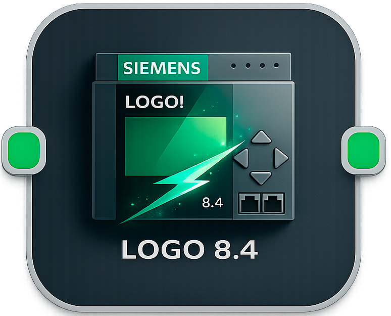
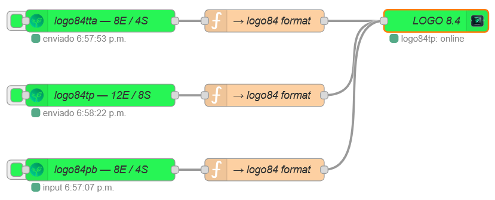
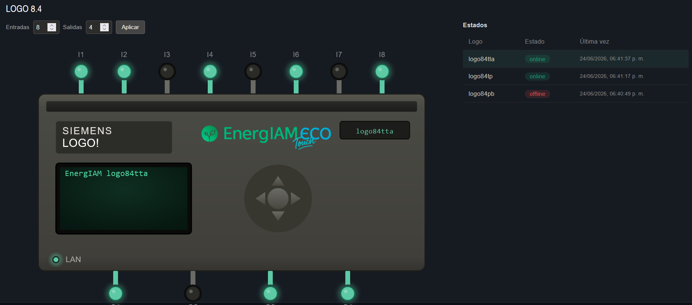
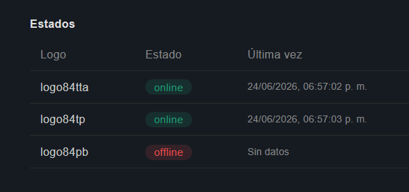
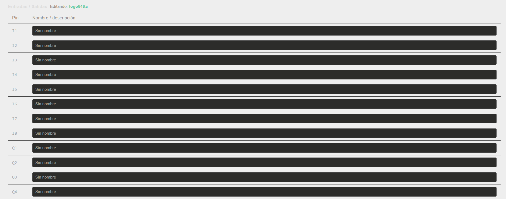

# node-red-dashboard-2-logo84-energiam

[](https://www.npmjs.com/package/node-red-dashboard-2-logo84-energiam)
[](https://nodered.org)
[](https://dashboard.flowfuse.com)
[](LICENSE)

**Dashboard 2.0 widget** for real-time visualization of **Siemens LOGO! 8.4** PLCs over MQTT.  
Part of the **EnergIAM** IIoT ecosystem.

---

## Screenshots




*Example flow — three simulated LOGO! devices connected to a single `ui-logo84` node*


*Real-time SVG panel with multi-device status table*


*Multi-device status table — online/offline detection with last-seen timestamp*


*Editable pin label table per device*

---

## Overview

`ui-logo84` is a single Node-RED node that monitors **multiple LOGO! 8.4 devices simultaneously** from a single MQTT subscription. Each device is detected automatically from the topic structure — no manual device configuration required.

### Features

- **Multi-device status table** — lists all detected LOGO! devices with online/offline badge and last-seen timestamp
- **Interactive SVG panel** — click any device to render its I/O diagram in real time; pin states update live via MQTT
- **Per-device independent configuration** — each device stores its own input/output count and pin label set
- **Editable pin labels** — assign custom names to each I/O pin per device; saved persistently in the node
- **Fully configurable** — MQTT topic prefix, heartbeat throttle, offline timeout, default pin counts, and LCD prefix are all configurable from the node editor
- **LAN LED** — reflects actual online/offline state of the selected device

---

## Requirements

| Dependency | Version |
|---|---|
| Node-RED | ≥ 3.0.0 |
| @flowfuse/node-red-dashboard | ≥ 1.0.0 |
| Node.js | ≥ 18.0.0 |

---

## Installation

### Via Node-RED Palette Manager
Search for `node-red-dashboard-2-logo84-energiam` in **Manage Palette → Install**.

### Via npm
```bash
cd ~/.node-red
npm install node-red-dashboard-2-logo84-energiam
```

Then restart Node-RED.

---

## Quick Start

1. Add a **`mqtt in`** node subscribed to your topic wildcard (e.g. `energiam/#`) with QoS 2
2. Connect it directly to the **`logo84`** node input
3. Place the `logo84` widget in a Dashboard 2.0 group
4. Deploy — devices appear automatically as MQTT messages arrive

```
[mqtt in  energiam/#] ──▶ [logo84]
```

No function node or transformation is needed.

---

## MQTT Message Format

The node expects the Shadow/reported state format used by the EnergIAM firmware:

```
Topic:   energiam/logo84pb/pub

Payload:
{
  "state": {
    "reported": {
      "$logotime": 1781987649,
      "entrada1": { "desc": "I-bit-1-1", "value": [1] },
      "salida1":  { "desc": "Q-bit-1-1", "value": [0] },
      ...
    }
  }
}
```

| Field | Description |
|---|---|
| `$logotime` | Unix timestamp — used for heartbeat / online detection |
| `I-bit-N-1` | Digital input N (1-based index) |
| `Q-bit-N-1` | Digital output N (1-based index) |

Messages without `$logotime` update pin states only (no heartbeat processing).

---

## Node Configuration

Open the node editor in Node-RED to configure:

| Property | Default | Description |
|---|---|---|
| **Name** | — | Display name in the editor |
| **Group** | — | Dashboard 2.0 group (required) |
| **Width / Height** | 12 / 10 | Widget size in grid units |
| **MQTT Topic Prefix** | `energiam` | Prefix before the device name in the topic. The device name is taken from the segment immediately after this prefix. |
| **Heartbeat throttle (s)** | `10` | Minimum interval between online/offline status updates per device |
| **Offline timeout (s)** | `60` | Time without a heartbeat before a device is marked offline |
| **Default inputs / outputs** | `8` / `4` | Default pin count for new devices (can be overridden per device in the widget) |
| **LCD Prefix** | _(empty)_ | Text shown before the device name on the SVG LCD display. Empty = device name only |

### Topic Prefix Examples

| Topic structure | Prefix setting | Device extracted |
|---|---|---|
| `energiam/logo84pb/pub` | `energiam` | `logo84pb` |
| `plant/line1/logo84pb/pub` | `plant/line1` | `logo84pb` |
| `logo84pb/pub` | _(empty)_ | `logo84pb` |

---

## Widget Usage

### Status Table
Displays all detected LOGO! devices. Each row shows:
- Device name (extracted from topic)
- **Online** / **Offline** badge
- Last seen timestamp

Click a row to select that device and load its SVG panel.

### SVG Panel
Visual representation of the selected LOGO! device:
- Input pins (top) and output pins (bottom) colored in real time
- Active pins glow green (`#5DCAA5`)
- LAN LED reflects actual connectivity
- LCD display shows the device name (with optional prefix)
- **Entradas / Salidas** spinners — change pin count for the selected device and click **Aplicar** to save

### I/O Pin Labels
Editable table showing all input (I) and output (Q) pins for the selected device. Names are saved per device and displayed as tooltips on the SVG pins.

---

## Example Flow

An example flow with three simulated LOGO! devices is included in:

```
examples/flows_logo84_simulator.json
```

Import it via **Node-RED Menu → Import** to test the widget without real hardware.  
Requires `node-red-contrib-device-simulator-energiam` for the simulator nodes.

---

## How It Works

```
MQTT message
    │
    ▼
Extract device name from topic (segment after prefix)
    │
    ├─ Accumulate I/Q bit states per device (incremental)
    │
    ├─ If $logotime present:
    │     ├─ Throttle check (default 10 s)
    │     ├─ Calculate online/offline (default 60 s timeout)
    │     └─ Update status table → emit to dashboard
    │
    └─ If selected device → emit SVG update to dashboard

Widget action (user click / Aplicar / pin name edit)
    │
    ▼
Handled in node via beforeSend hook → update state → emit
```

State is held in closure variables (not `node.context()`), ensuring compatibility with all Node-RED context store configurations including file-based stores.

---

## License

MIT © [EnergIAM EcoTouch](https://github.com/energiamEcoTouch)
